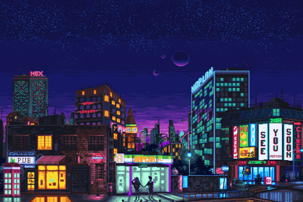

<h2 align="center">Hi!, I'm Guilherme Gaspar 😁</h2>

 
<h3>About me:</h3>

I'm 18 years old and currently in the 4th semester of a Bachelor's degree in Computer Science at the Universidade Estadual do Ceará (UECE), with a strong focus on Software Engineering.

I am a member of the Software Engineering and Distributed Systems Group (GESAD) and the Development and Innovation Laboratory (LDI).

Currently, I apply my knowledge in real-world projects as a Mobile Developer, contributing to initiatives such as Dell Technologies and Conecta. Through these experiences, I work with mobile technologies, software architecture, and collaborative development workflows.

I am passionate about learning, building, and continuously evolving as a developer.

<table width="100%" >

 <tr>
    <td width="60%">
     
## 🛠️ Skills

#### Languages

#### Engines & Frameworks

     
   
#### Database / Backend

#### Tools

</td>
    <td>

<picture> </picture>

<h3 align="center">Stats</h3>

  
  

     
  </td>
 </tr>
</table>

 

